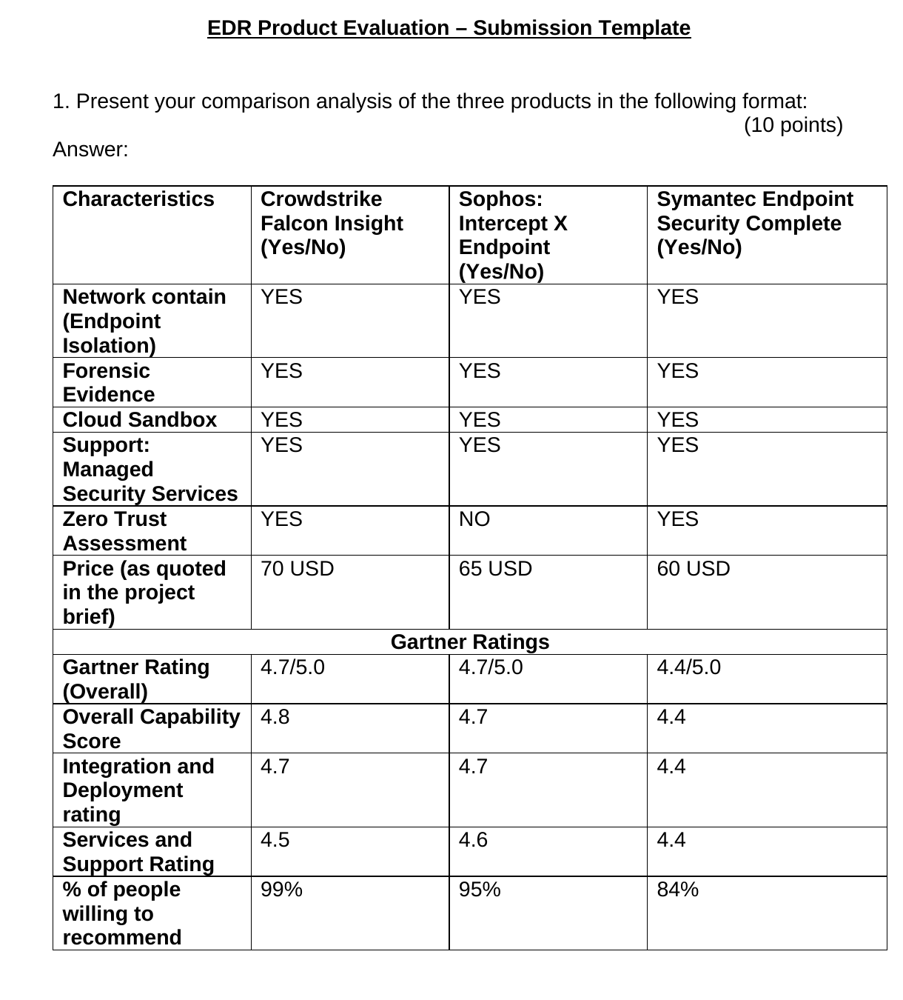
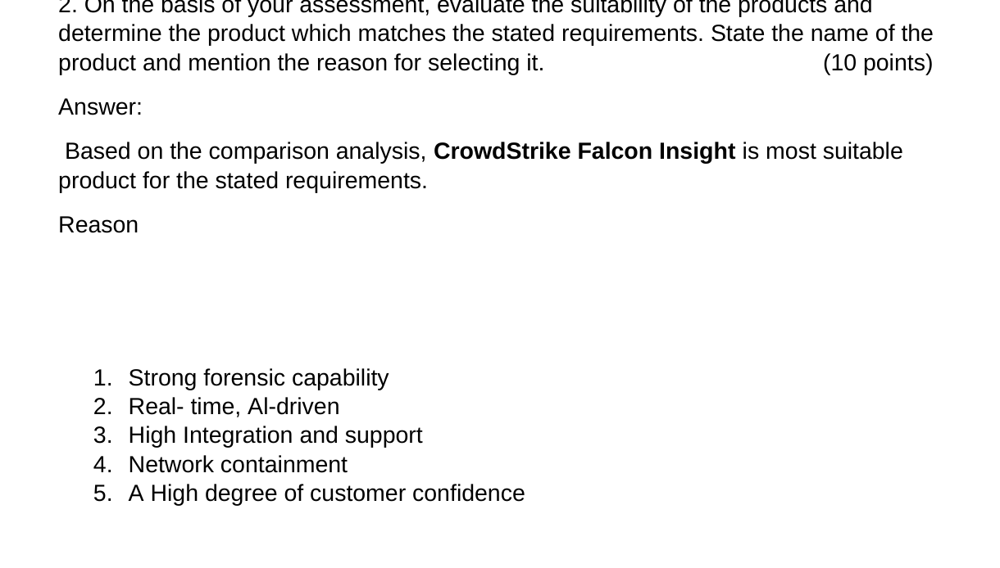
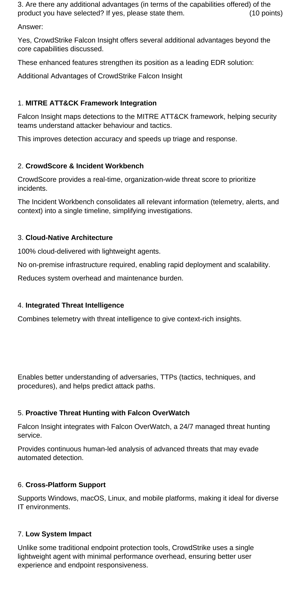
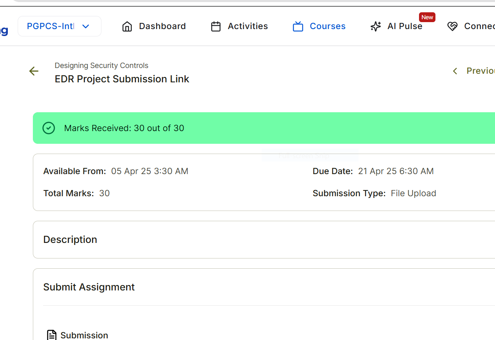

# Endpoint Detection & Response (EDR) Product Evaluation

**Project completed:** 2025  
**Published to GitHub portfolio:** 2026

## 🔎 Project Overview

This project demonstrates practical knowledge of Endpoint Detection and Response (EDR), endpoint security, digital forensics, threat detection, incident response, and cybersecurity product evaluation.

The assessment compared three enterprise EDR solutions:

- CrowdStrike Falcon Insight
- Sophos Intercept X Endpoint
- Symantec Endpoint Security Complete

The objective was to evaluate each product against technical and operational security requirements and recommend the most suitable solution.

---

## 🎯 Project Objectives

- Compare enterprise EDR capabilities
- Evaluate endpoint isolation and containment
- Assess forensic investigation capabilities
- Review malware-analysis and sandbox functionality
- Evaluate managed security-service support
- Compare Zero Trust-related capabilities
- Assess deployment and integration
- Compare vendor support and customer confidence
- Recommend the most suitable EDR platform

---

## 📊 Product Comparison

| Capability | CrowdStrike Falcon Insight | Sophos Intercept X | Symantec Endpoint Security Complete |
|---|---|---|---|
| Endpoint Isolation | Yes | Yes | Yes |
| Forensic Evidence | Yes | Yes | Yes |
| Cloud Sandbox | Yes | Yes | Yes |
| Managed Security Services | Yes | Yes | Yes |
| Zero Trust Assessment | Yes | No | Yes |
| Price | $70/seat | $65/seat | $60/seat |
| Gartner Overall Rating | 4.7/5 | 4.7/5 | 4.4/5 |
| Overall Capability Score | 4.8 | 4.7 | 4.4 |
| Integration & Deployment | 4.7 | 4.7 | 4.4 |
| Services & Support | 4.5 | 4.6 | 4.4 |
| Users Willing to Recommend | 99% | 95% | 84% |

---

## 🏆 Recommended Solution

### CrowdStrike Falcon Insight

Based on the evaluation, CrowdStrike Falcon Insight was selected as the most suitable product.

### Key Reasons

- Strong forensic capability
- Real-time AI-driven detection
- Network containment capability
- Strong integration and deployment capability
- High customer confidence
- Broad endpoint-security functionality

---

## 🔍 Additional Advantages

### MITRE ATT&CK Integration

Falcon Insight maps detections to the MITRE ATT&CK framework, helping analysts understand attacker behaviour, tactics and techniques.

### CrowdScore & Incident Workbench

CrowdScore supports real-time threat prioritization, while Incident Workbench consolidates telemetry, alerts and investigation context into a centralized investigation view.

### Cloud-Native Architecture

The platform uses a cloud-delivered architecture with lightweight endpoint agents, reducing the need for on-premise infrastructure.

### Integrated Threat Intelligence

Endpoint telemetry can be combined with threat intelligence to provide additional context about adversaries and attacker techniques.

### Proactive Threat Hunting

CrowdStrike Falcon OverWatch provides managed threat-hunting capabilities designed to identify advanced threats that may evade automated detection.

### Cross-Platform Support

The platform supports multiple endpoint environments including:

- Windows
- macOS
- Linux
- Mobile platforms

### Low Endpoint Impact

The lightweight-agent architecture is designed to reduce performance impact on endpoint systems.

---

## 🛡️ Security Capabilities Evaluated

The evaluation covered:

- Endpoint Detection & Response
- Network containment
- Digital forensics
- Malware sandboxing
- Managed detection and response
- Zero Trust
- Threat intelligence
- Threat hunting
- Security analytics
- Incident investigation
- Endpoint telemetry
- Deployment and integration

---

## 🧠 Skills Demonstrated

- Endpoint Detection & Response (EDR)
- Endpoint Security
- Security Product Evaluation
- Incident Response
- Digital Forensics
- Threat Detection
- MITRE ATT&CK
- Threat Intelligence
- Zero Trust
- Security Architecture
- Vendor Evaluation
- Cybersecurity Decision-Making

---

## 📈 Key Takeaways

This project strengthened my ability to evaluate security technologies based on both technical capability and operational requirements.

It also demonstrated the importance of balancing:

- Security effectiveness
- Deployment complexity
- Endpoint performance
- Forensic capability
- Detection quality
- Threat intelligence
- Support
- Cost
- Organizational requirements

## 📸 Project Screenshots

### 1. EDR Product Comparison

### 2. CrowdStrike Recommendation

### 3. CrowdStrike Advanced Capabilities

### 4. Assessment Result — 30/30

---

## 📄 Project Evidence

The completed EDR Product Evaluation submission is included in this repository as supporting evidence.

[📄 View EDR Product Evaluation Submission](EDR%20Product%20Evaluation%20%20Submission.docx)

---

## 👨‍💻 Author

**Benard Obi Kekong**

Cybersecurity Analyst | CompTIA Security+ | SOC & GRC | Microsoft Sentinel | SIEM | Risk Assessment | Python
